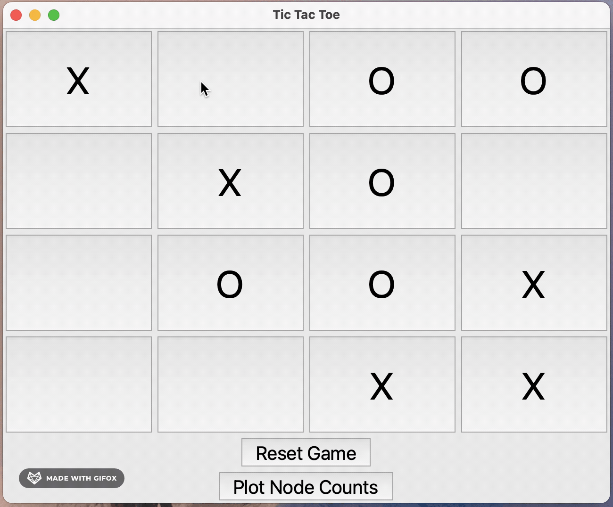

# 4x4 Tic-Tac-Toe AI 👾

## Overview 🎮
This Tic-Tac-Toe AI project showcases an artificial intelligence implementation using the minimax algorithm with alpha-beta pruning to challenge human players in Tic-Tac-Toe! The project features a Python-based graphical user interface (GUI) for interactive gameplay, offering both an educational insight into AI algorithms and a fun, engaging user experience.

## Features ✨
- **Interactive GUI**: Play against an AI directly through a user-friendly graphical interface.
- **Intelligent AI**: Utilizes the minimax algorithm with alpha-beta pruning for efficient and challenging gameplay.
- **Real-Time Feedback**: Displays the game state dynamically and updates after each move, showing both player and AI moves.
- **Game Over Detection**: Detects game over conditions (win, lose, or draw) and displays the result accordingly.
- **Graphing Nodes Expanded**: After you play, you can generate a graph showing the number of nodes the AI expanded at each move, both with and without alpha beta pruning. This demonstrates the huge difference in efficiency. Make sure to note that the graph generated is log scale!

## Prerequisites 🔧
To run this application, you need:
- Python 3.6 or higher.
- Tkinter for the GUI (comes pre-installed with Python in most cases).
- - Matplotlib for generating performance graphs.


## Installation & Usage 🖱️
Clone the repository to your local machine:
```bash
git clone https://github.com/yourgithubusername/tictactoe-ai.git
cd tictactoe-ai
```

Execute the following command at the root of the project directory to start the game:

```bash
python gui.py
```

You may need to use 
```bash
python3 gui.py
```

Use the GUI to make moves against the AI. Click on an empty square to make your move, and the AI will respond on its turn.

## How It Works 🤖
- **Minimax Algorithm**: The minimax algorithm is used to simulate decision-making for two-player games. By creating a game tree, it anticipates potential future moves and chooses the optimal path by minimizing the possible loss for a worst-case scenario.

- **Alpha-beta Pruning**: Alpha-beta pruning enhances the minimax algorithm by reducing the number of nodes evaluated, thereby speeding up decision-making by effectively pruning branches that will not influence the final decision.


## Flowchart 🦦


## Quick GIF Demo 👀


